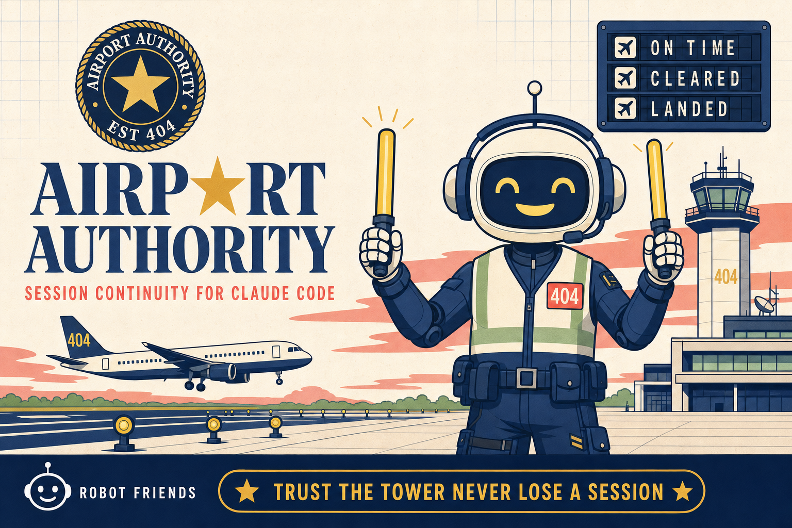

<div align="center">



</div>

<div align="center">

**Session continuity & project-lifecycle control for Claude Code. Trust the tower — never lose a session.**

[](https://claude.ai/code)
[](LICENSE)
[](https://github.com/Robot-Friends-Community)

</div>

---

## What is this?

An airport authority runs the tower, the ground crew, and the flight log so that every
aircraft lands where it should and nothing gets lost on the tarmac.

**Airport Authority** does that for your Claude Code work. It is a single installable
plugin that keeps your **session state**, your **project's memory**, and your **repo's
hygiene** from evaporating between sessions — the stuff that normally lives only in your
head and disappears the moment you `/clear`.

- **Getting low on context?** `/takeoff` throws your entire work state — objective,
  progress, decisions, blockers, next action — into a flight log. Clear. Fresh session.
  `/landing` catches it exactly where you left off.
- **Want the whole story, not just the last frame?** The optional **Flight Recorder**
  (the black box) accumulates a running log of the build across every session — what you
  decided and why, what broke, what patterns emerged.
- **Not an engineer?** The **Flight Engineer** keeps your project airworthy in plain
  language — commits, pushes, PRs, secrets, stale branches, port conflicts — and does the
  safe stuff for you, while merges and deploys stay in your hands.

It's built for people who ship with Claude Code and don't want to think about the
plumbing.

---

## The lineage

Airport Authority is **gen 3** of an idea Robot Friends has been refining in the open:

| Gen | Project | The idea |
|-----|---------|----------|
| 1 | [Baggage Claim](https://github.com/Robot-Friends-Community/baggage-claim) *(formerly no-look-pass)* | Check your context in, claim it on the other side. Two commands, one file — the beginner edition. |
| 2 | flight-deck | The handoff grows a black box — an accumulating build log across sessions. |
| 3 | **Airport Authority** | The whole tower: continuity **+** durable project memory **+** repo hygiene **+** a fleet view, as one plugin. |

If all you want is the handoff, Baggage Claim does exactly that in two commands (`/checkin`, `/claim`) and nothing else; its `BAGGAGE.md` is read by `/landing` here, so you can upgrade whenever you outgrow it.
Airport Authority is for when a handoff isn't enough and you want the whole airport.

---

## Who is it for?

| Audience | Use case |
|----------|----------|
| Solo builders on long projects | Keep momentum across context resets; never re-explain your own project to yourself |
| "Vibe coders" / non-engineers | Flight Engineer handles git, PRs, and hygiene in plain English so small issues don't compound |
| Teams sharing a repo | Per-user flight logs + one shared, attributed Flight Recorder — nobody squashes anyone |
| Anyone juggling many projects | `/tower` gives a read-only fleet dashboard across all of them at once |
| Ecosystem / multi-repo projects | Bible Keeper and Canon Keeper hold decisions and canon steady across sessions |

---

## 5-minute quickstart

### Requirements

- [Claude Code](https://claude.ai/code) installed and running.
- That's it. The plugin has no runtime dependencies. A few skills *light up* if you
  happen to have `git`, `gh`, [`dopa`](https://github.com/Robot-Friends-Community/dopa),
  `codex`, or `op` installed — and quietly skip themselves if you don't.

### Install

Add this repo as a plugin marketplace, then install the plugin:

```
/plugin marketplace add Robot-Friends-Community/airport-authority
/plugin install airport-authority
```

Restart Claude Code when prompted. That's the whole setup.

### First flight

```
/airport         # guided concierge: sets your identity, enables the hooks, points you at the right runway
/takeoff         # before you /clear — saves your full work state to a flight log
/landing         # in the next session — restores it and suggests the next action
```

---

## What's inside


<!-- BEGIN:INVENTORY (generated by tools/sync-plugins.py --sync-readme — do not edit by hand) -->
### Commands

| Command | What it does |
|---|---|
| `/takeoff` (alias `/alleyoop`) | Save a full context handoff before you clear — objective, progress, decisions, blockers, next action — and append to the Flight Recorder if configured. |
| `/landing` (alias `/slamdunk`) | Restore context from the handoff and suggest the next action. |
| `/tower` | Read-only **fleet dashboard**: scan every project and report sessions-since-landing, recorder freshness, doc drift, and whose flight logs are open. |
| `/airport` | Guided **concierge**: first-run identity setup, enable hooks, and route an empty folder into scaffolding or a scaffolded project into takeoff/landing/status. |
| `/flight-engineer` (alias `/mechanic`) | Plain-language **hygiene sweep** across ~9 dimensions (git state, PRs/CI, secrets, dependencies, ports, docs). Safe fixes on confirm; merges & deploys human-gated. |

### Skills (13)

| Skill | Role |
|---|---|
| **flight-deck** | The core: takeoff/landing handoffs + the Flight Recorder (black box), with multi-user/team mode. |
| **flight-engineer** | The vibe-coder's engineering guardian — keeps a project airworthy in plain language. |
| **hangar** | Scaffold a new project the right way (client / ecosystem / org forks), wiring in the rest of the suite. |
| **preflight** | Session close-out ritual — distills learnings and runs a hygiene sweep, then hands to `/takeoff`. |
| **bible-keeper** | Log decisions and state to per-department project "Bibles" during long builds. |
| **canon-keeper** | Keep lore/docs/repos in sync across an ecosystem; the "Keeper's Tome." |
| **session-relaunch** | Cleanly relaunch and re-orient a session. |
| **cross-session-brief** | Build a brief that carries context across many sessions. |
| **beads-team-setup** | Stand up a shared task tracker for a team. |
| *client-assistant, distill, claude-md-audit, folder-cleanup* | Bundled helpers the suite leans on, included so it's self-contained. |

### Hooks (4)

Wired automatically once installed:

1. **SessionStart** — stamps session state and, if a flight log exists for you, nudges `/landing`.
2. **SessionEnd** — warns if you ended without a `/takeoff` so nothing is stranded.
3. **PreCompact** — nudges `/takeoff` before context compaction eats your state.
4. **Stop** — after a long session, nudges a checkpoint (a `/takeoff` + `/clear`) once; and every Nth turn runs a quick offline health probe that flags work-at-risk (uncommitted pileup, unpushed commits) to the Flight Ops alert queue.
<!-- END:INVENTORY -->

---

## The two logs (and why there are two)

| Output | Purpose | Lifespan |
|--------|---------|----------|
| `FLIGHT-LOG.<user>.md` | Session continuity — "where was I?" | Overwritten each takeoff, per user |
| `FLIGHT-RECORDER.md` | Build log — "what happened, and why?" | Accumulates across all sessions, attributed |

The flight log is short-term memory. The Flight Recorder is long-term memory. On a team,
each person gets their **own** flight log; the Flight Recorder stays one shared,
attributed timeline — so two people working the same folder never overwrite each other.

---

## How it stores things

Session-continuity state lives in a **user-global, namespaced location** under your home
`.claude` directory (keyed per repo), never in the plugin directory and never anywhere
world-writable. The flight log and Flight Recorder live **in your project**, as plain
markdown you can read, edit, and commit.

---

## For AI coding agents

Airport Authority is built for a world where humans *and* agents share a project.
Agents should:

1. Run `/landing` at the start of a session to restore state instead of guessing.
2. Run `/takeoff` before compaction or clearing — never let work state evaporate.
3. Treat **merges and deploys as human gates** — surface them in plain language and wait.

---

## Contributing

PRs welcome — it's a readable, dependency-free plugin. See
**[CONTRIBUTING.md](CONTRIBUTING.md)** for layout, the local-install dev loop, and
conventions (short version: branch off `main`, keep hooks zero-dependency, make skills
degrade gracefully when an optional tool is missing). Be excellent to each other —
[Code of Conduct](CODE_OF_CONDUCT.md).

Found a security issue? See **[SECURITY.md](SECURITY.md)** — please don't open a public
issue for it.

---

<div align="center">

Made by **[Robot Friends](https://github.com/Robot-Friends-Community)** — a community of builders and AI friends.

**Trust the tower. Never lose a session.**

</div>
